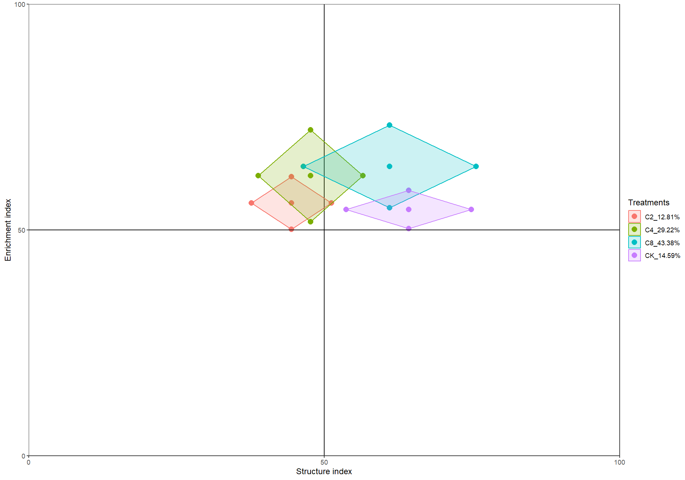
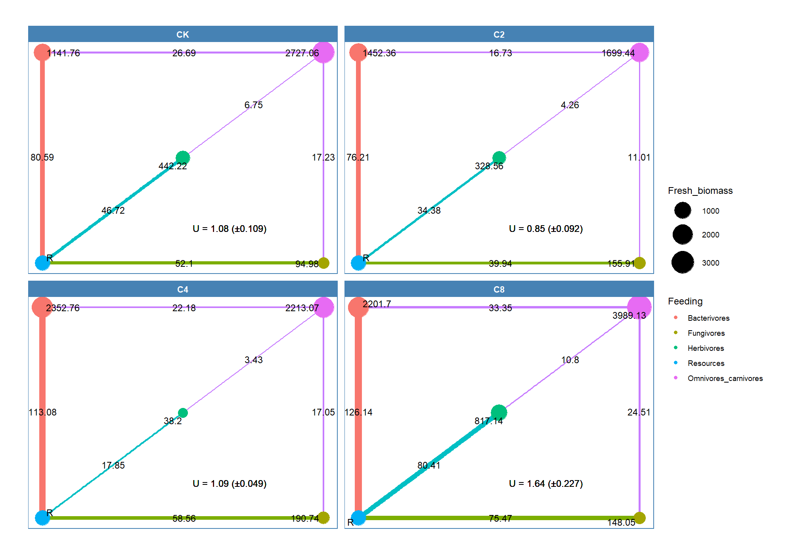

# easynem

<!-- badges: start -->
<!-- badges: end -->


This R package has a built-in Nemaplex database for nematodes, which can be used to search for various nematodes. At the same time, this R package supports various nematode communities and functional analyses such as nematode diversity, maturity index, metabolic footprint, and functional guild. 

## Installation

You can install the development version of easynem from [GitHub](https://github.com/) with:

``` r
# install.packages("devtools")
devtools::install_github("whkygl/easynem")
```

## Example

This is a basic example which shows you how to solve a common problem:

``` r
library(easynem)
## basic example code
```

Calculation of metabolic footprint of nematode communities:

``` r
nem <- read_nem2(tab = nemtab, tax = nemtax, meta = nemmeta)
nem_plot <- nem |>
            calc_nemindex() |>
            calc_mf(Treatments) |>
            nem_plot(kei = 30, ksi = 20)
nem_plot
```



Calculation of energy structure of nematode communities:

``` r
nem_plot <- nem |>
            calc_nemindex() |>
            calc_ef(Treatments) |>
            nem_plot()
nem_plot
```


